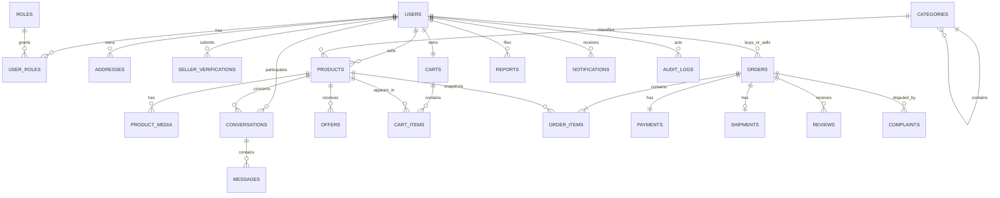

# Thiết kế database — Trust-oriented Second-hand C2C Marketplace

Tài liệu này chốt thiết kế MVP dựa trên file handoff. DDL triển khai nằm tại `second_hand_marketplace_schema.sql` và nhắm đến PostgreSQL 15+.

## 1. Các quyết định đã chốt

1. Dùng tên bảng số nhiều, `snake_case`; tránh các từ khóa SQL như `user` và `order` bằng `users`, `orders`.
2. Khóa chính dùng `BIGINT GENERATED BY DEFAULT AS IDENTITY`, thuận tiện cho PostgreSQL và JPA/Hibernate.
3. Tiền dùng `NUMERIC(19,2)`, không dùng `float`/`double`. MVP chỉ chấp nhận `VND`.
4. Thời gian dùng `TIMESTAMPTZ` để không phụ thuộc múi giờ của server.
5. Các trạng thái dùng `VARCHAR + CHECK`, thay vì PostgreSQL enum, để migration thay đổi trạng thái dễ hơn.
6. `orders` chứa đầy đủ snapshot địa chỉ giao hàng. `source_address_id` chỉ là tham chiếu nguồn và được phép về `NULL`.
7. MVP coi mỗi listing là một món độc nhất: `cart_items.quantity = 1` và `order_items.quantity = 1`.
8. Không hard-delete dữ liệu giao dịch. `users`, `addresses`, `products`, `reviews` có `deleted_at`; `orders`, `payments`, `complaints`, `audit_logs` chỉ thay đổi trạng thái.
9. `order_items` lưu snapshot `product_title`, `unit_price`, `line_total`; lịch sử đơn không phụ thuộc dữ liệu sản phẩm hiện tại.
10. Một đơn có đúng tối đa một payment và một shipment thông qua `UNIQUE(order_id)`.
11. `products`, `orders`, `payments` có cột `version` để ánh xạ trực tiếp với JPA `@Version`.
12. `products.reserved_order_id` xác định order đang giữ món hàng. Composite FK tới `(order_items.order_id, order_items.product_id)` bảo đảm order owner thực sự chứa product đó; job timeout không được giải phóng reservation nếu owner không khớp.
13. Các order tách từ một cart nhiều seller dùng chung `checkout_group_id`.

## 2. ERD mức khái quát



## 3. Invariant do database bảo vệ

- Email được chuẩn hóa lowercase và unique; số điện thoại unique khi có giá trị.
- Mỗi user chỉ có một địa chỉ mặc định chưa xóa.
- Mỗi user chỉ có một hồ sơ KYC đang `PENDING` hoặc đã `VERIFIED`; các lần bị từ chối vẫn được giữ lịch sử.
- Một buyer/seller/product chỉ có một conversation.
- Một buyer chỉ có một offer `PENDING` trên một product.
- Buyer và seller không được là cùng một user trong conversation, offer và order.
- Tổng đơn luôn thỏa `total_amount = subtotal + shipping_fee`.
- Một review duy nhất cho mỗi bộ `(order, reviewer, reviewee)` và rating từ 1 đến 5.
- Mỗi order chỉ có một complaint đang hoạt động (`OPEN` hoặc `REVIEWING`).
- Complaint, payment, report có các trường kết quả/thời gian phù hợp với trạng thái.
- Report phải trỏ đến ít nhất user hoặc product.
- Tất cả FK phục vụ truy vấn chính đều có index; index có điều kiện được dùng cho inbox chưa đọc, listing active, KYC pending, complaint active và reservation hết hạn.

## 4. Invariant phải bảo vệ trong service transaction

Một số rule liên quan nhiều bảng không nên nhét vào `CHECK` hoặc trigger phức tạp. Service phải kiểm tra chúng trong cùng transaction:

- Chỉ user có KYC `VERIFIED` và role `SELLER` mới được publish product.
- `products.seller_id` phải bằng seller của conversation, offer và order chứa sản phẩm đó.
- Người gửi message phải là buyer hoặc seller của conversation.
- Address nguồn phải thuộc buyer; snapshot address phải được copy trước khi tạo order.
- Tất cả `order_items` trong một order phải có cùng seller với `orders.seller_id`.
- `orders.subtotal` phải bằng tổng `order_items.line_total`.
- `payments.amount` phải bằng `orders.total_amount`.
- Chỉ buyer hoặc seller của order được mở complaint; chỉ admin được resolve.
- Chỉ buyer/seller của order được review đối tác và chỉ khi order `COMPLETED`.
- `complaints.refund_amount` không được lớn hơn `payments.amount`.
- Admin account/role không được cấp qua luồng đăng ký công khai.
- Category tree không được có chu trình; service phải kiểm tra toàn bộ ancestor khi đổi parent.

Các rule trên nên nằm trong domain service và được kiểm thử integration bằng database thật.

## 5. Checkout và chống bán trùng

Cart nhiều seller phải được nhóm theo `products.seller_id`; mỗi nhóm tạo một order độc lập. Mỗi nhóm chạy trong một transaction. Với từng product, khóa row trước khi kiểm tra:

```sql
BEGIN;

SELECT product_id, seller_id, title, price, status
FROM products
WHERE product_id IN (:product_ids)
ORDER BY product_id
FOR UPDATE;

-- Service kiểm tra tất cả product còn ACTIVE, chưa deleted và cùng seller.
-- Tạo orders + order_items từ snapshot hiện tại, sau đó:

UPDATE products
SET status = 'RESERVED',
    reserved_order_id = :order_id,
    reserved_until = CURRENT_TIMESTAMP + INTERVAL '15 minutes',
    updated_at = CURRENT_TIMESTAMP
WHERE product_id IN (:product_ids)
  AND status = 'ACTIVE'
  AND deleted_at IS NULL;

-- Service bắt buộc kiểm tra updated row count bằng số product yêu cầu.
COMMIT;
```

Luôn khóa product theo thứ tự `product_id` để giảm deadlock. Không đọc `ACTIVE` rồi update ở hai transaction tách biệt.

Job hết hạn payment phải khóa order và các product liên quan, chuyển order sang `CANCELLED`, payment `PENDING/FAILED` theo kết quả nghiệp vụ, rồi đưa product `RESERVED -> ACTIVE` trong cùng transaction. Lệnh release phải có điều kiện `reserved_order_id = :order_id`, đồng thời đặt `reserved_order_id` và `reserved_until` về `NULL`. Khi payment được giữ thành công, order chuyển `PAYMENT_PENDING -> PAID_HELD`; product tiếp tục `RESERVED` cho đến khi seller xác nhận, sau đó chuyển `SOLD` và xóa hai trường reservation.

## 6. State transition hợp lệ

### Product

```text
DRAFT -> PENDING -> ACTIVE -> RESERVED -> SOLD
          |          |          |
          v          v          v
       REJECTED    HIDDEN      ACTIVE (payment fail/timeout/cancel)
```

### Order

```text
PAYMENT_PENDING -> PAID_HELD -> SELLER_CONFIRMED -> SHIPPED -> DELIVERED -> COMPLETED
       |                |                                |
       v                v                                v
   CANCELLED         CANCELLED                         DISPUTED -> REFUNDED
                                                          |
                                                          v
                                                      COMPLETED
```

### Payment

```text
PENDING -> PAID -> HELD -> RELEASED
   |                 |
   v                 v
 FAILED        REFUND_PENDING -> REFUNDED
```

`PAID` có thể là trạng thái rất ngắn trong callback; vẫn giữ để phản ánh flow từ cổng thanh toán giả lập.

## 7. Các cặp trạng thái Order–Payment chính

| Order | Payment | Ý nghĩa |
|---|---|---|
| `PAYMENT_PENDING` | `PENDING` hoặc `FAILED` | Chờ thanh toán hoặc thanh toán lỗi trước khi job hủy đơn |
| `PAID_HELD` | `HELD` | Tiền đã được giữ |
| `SELLER_CONFIRMED` / `SHIPPED` / `DELIVERED` | `HELD` | Chưa giải ngân |
| `DISPUTED` | `HELD` hoặc `REFUND_PENDING` | Đóng băng xử lý tranh chấp |
| `COMPLETED` | `RELEASED` | Đã giải ngân seller |
| `REFUNDED` | `REFUNDED` | Đã hoàn tiền buyer |

Mọi cập nhật hai bảng phải chạy trong cùng transaction. Ánh xạ cột `version` bằng JPA `@Version`; riêng checkout và payment/dispute command vẫn nên dùng pessimistic lock (`PESSIMISTIC_WRITE`) vì đây là các đoạn tranh chấp tài nguyên trực tiếp.

## 8. Xóa và lưu lịch sử

- `users`: deactivation đặt `status = 'DEACTIVATED'`, `deleted_at`; không xóa role/lịch sử.
- `addresses`: soft-delete; order vẫn có snapshot độc lập và FK nguồn dùng `ON DELETE SET NULL` như lớp bảo vệ bổ sung.
- `products`: ẩn bằng `HIDDEN` và có thể đặt `deleted_at`; product đã nằm trong order không được hard-delete.
- `orders`, `order_items`, `payments`, `shipments`, `complaints`, `audit_logs`: tuyệt đối không hard-delete từ API nghiệp vụ.
- Media/cart item chưa tham gia giao dịch có thể xóa vật lý. Việc xóa file trên object storage là workflow riêng.

## 9. Ghi chú trước khi tạo migration production

- File hiện tại là baseline review, chưa gắn với Flyway/Liquibase vì repository chưa có backend hoặc công cụ migration.
- Nếu chọn Flyway, đổi tên thành `src/main/resources/db/migration/V1__initial_schema.sql` khi khởi tạo Spring Boot.
- Không để Hibernate tự sửa schema trong production; dùng `spring.jpa.hibernate.ddl-auto=validate`.
- Cần integration test cho: checkout tranh chấp đồng thời, payment callback lặp, hết hạn reservation, resolve complaint, unique default address và review authorization.
- Callback thanh toán cần idempotency dựa trên `transaction_code` và/hoặc một idempotency key do provider trả về.

## 10. Bảo mật dữ liệu xác minh

`seller_verifications.document_data` chỉ nên giữ metadata tối thiểu và object key của file trong private object storage. Không lưu ảnh CCCD dưới dạng base64, không lưu public URL dài hạn và không ghi số giấy tờ nguyên bản vào audit log. File phải được mã hóa, truy cập bằng signed URL ngắn hạn, giới hạn cho admin được phân quyền và có chính sách xóa sau thời hạn lưu trữ của đồ án. `password_hash` dùng Argon2id hoặc BCrypt; tuyệt đối không lưu password hoặc payment secret trong database.
