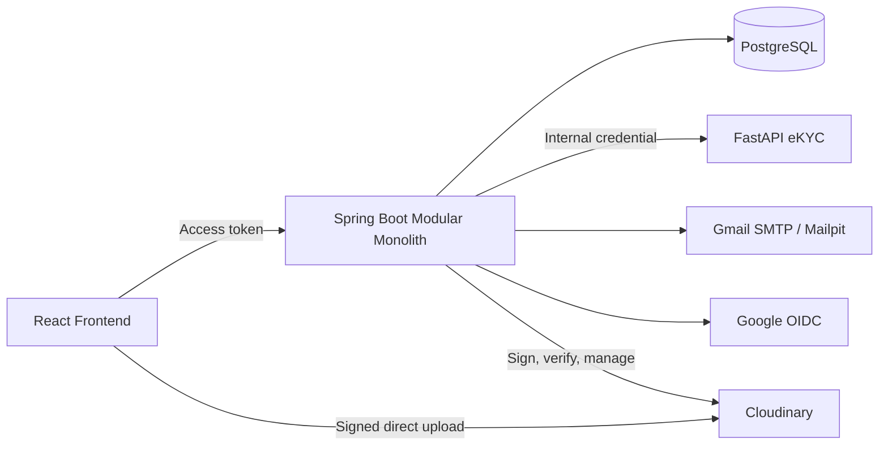

# Kế hoạch triển khai Bước 2 — Identity, eKYC và External Integrations

- Project: Old but Gold (O.G Shop)
- Ngày lập: 2026-09-18
- Ngày dự kiến bắt đầu: 2026-09-19
- Trạng thái: APPROVED — TASK-0005 hoàn thành; TASK-0006 là bước kế tiếp
- Phạm vi: UC-01, UC-02 và nền tảng media cho UC-03, UC-12

## 1. Mục tiêu

Xây dựng backend Identity và ranh giới eKYC an toàn trước khi tích hợp Gmail, Google OAuth2 và dịch vụ lưu trữ media. Kế hoạch ưu tiên tính đúng đắn, khả năng giải thích và phạm vi phù hợp đồ án môn học.

Kết quả cuối cùng dự kiến:

- Mật khẩu được hash và xác minh tại Spring Boot.
- Access token ngắn hạn và refresh token có thể rotate/revoke.
- Frontend không thể tự cấp role `SELLER`.
- Frontend không gọi trực tiếp FastAPI eKYC và không nhận face embedding.
- OTP khôi phục mật khẩu được gửi qua adapter email.
- Google OIDC được xác minh tại backend.
- Media được upload bằng chữ ký do backend cấp.
- Không lưu hoặc gửi dữ liệu CCCD/sinh trắc học thật trong phạm vi đồ án.

## 2. Các quyết định kỹ thuật đề xuất

Các quyết định D-01 đến D-05 đã được chủ dự án phê duyệt ngày 2026-09-19. Mỗi task vẫn được triển khai và kiểm chứng riêng.

### D-01 — BCrypt cho mật khẩu

**Lựa chọn đề xuất:** Spring Security `DelegatingPasswordEncoder` với BCrypt và prefix `{bcrypt}`.

**Lý do:**

- Được Spring Security hỗ trợ trực tiếp, không cần thêm BouncyCastle.
- Phù hợp máy cá nhân, CI và quy mô đồ án.
- Dễ giải thích, đo đạc và kiểm thử hơn Argon2.
- Prefix encoder cho phép chuyển sang Argon2 sau này mà vẫn xác minh được mật khẩu BCrypt cũ.

**Trade-off:** Argon2 chống phần cứng crack chuyên dụng tốt hơn nhờ memory-hard, nhưng cần thêm dependency, RAM và bước hiệu chỉnh. BCrypt vẫn cần benchmark work factor trên môi trường thực tế; không xem một cost cố định là phù hợp cho mọi máy.

**Quy tắc triển khai:**

- Không hash mật khẩu trong frontend.
- Không dùng SHA-256 trực tiếp để lưu mật khẩu.
- Không log password, hash hoặc credential.
- Đo thời gian `encode`/`matches`; chọn work factor cân bằng bảo mật và khả năng chạy test.

### D-02 — Refresh token trong cookie HttpOnly

**Lựa chọn đề xuất:** access token ngắn hạn giữ trong memory của frontend; refresh token opaque đặt trong cookie `HttpOnly` và chỉ lưu hash ở database.

**Thuộc tính production dự kiến:**

```http
Set-Cookie: og_refresh=<token>; HttpOnly; Secure; SameSite=Lax; Path=/api/v1/auth/refresh
```

**Lý do:** JavaScript không thể đọc refresh token; giảm khả năng token bị lấy trực tiếp khi có XSS và an toàn hơn `localStorage`.

**Trade-off:** trình duyệt tự gửi cookie nên phải phòng CSRF, kiểm tra `Origin`, giới hạn CORS, dùng HTTPS và xử lý khác biệt giữa local/prod. HttpOnly bảo vệ tính bí mật của token nhưng không ngăn mã XSS gửi request thay người dùng.

**Quy tắc triển khai:**

- Refresh token có entropy cao, single-use và rotate sau mỗi lần refresh.
- Phát hiện reuse thì revoke toàn bộ token family.
- Logout phải revoke server-side và xóa cookie.
- Response chứa session/token dùng `Cache-Control: no-store`.
- Không đặt token trong URL, `localStorage` hoặc log.

### D-03 — Không lưu face embedding thật

**Lựa chọn đề xuất:** chỉ dùng embedding tổng hợp trong seed/test; hồ sơ demo chỉ lưu kết quả xác minh và metadata thuật toán.

**Metadata được phép lưu:**

- `verification_id`, trạng thái và phương thức xác minh.
- `match_distance`, `threshold_used`.
- `model_name`, `model_version`.
- Thời điểm xử lý và cờ `is_simulated`.

**Lý do:** embedding khuôn mặt là dữ liệu sinh trắc học không thể thay đổi như mật khẩu. Lưu dữ liệu thật đòi hỏi consent, retention, deletion, access control và xử lý pháp lý vượt ngoài phạm vi đồ án.

**Trade-off:** không thể tái xác minh hoặc phát hiện một khuôn mặt đăng ký nhiều tài khoản nếu không quét lại; pgvector không được dùng để tìm kiếm trên người thật. Khả năng pgvector vẫn được minh họa bằng dữ liệu tổng hợp tách khỏi user thật.

**Quy tắc triển khai:**

- Không dùng CCCD, ảnh mặt hoặc embedding thật trong demo/test.
- Ảnh tạm phải bị xóa sau xử lý hoặc theo retention rất ngắn.
- UI mô tả đây là face matching/eKYC mô phỏng, không tuyên bố KYC production hoặc anti-spoof production.
- Không gửi face embedding qua frontend.

### D-04 — Cloudinary là media provider duy nhất trong MVP

**Lựa chọn đề xuất:** dùng Cloudinary cho avatar, ảnh/video sản phẩm và bằng chứng; vẫn che SDK sau các outbound port để có thể thêm ImageKit sau.

**Phân vùng dự kiến:**

```text
og-shop/avatars/   -> public delivery, image only
og-shop/products/  -> public delivery, image/video
og-shop/evidence/  -> authenticated/private delivery
```

**Lý do:** Cloudinary đáp ứng ảnh, video, transformation, signed upload và authenticated asset. Một provider giảm SDK, secret, webhook, test, cleanup và lỗi phân tán.

**Trade-off:** tăng vendor lock-in và không trình diễn multi-provider. Dùng đồng thời ImageKit và Cloudinary cho thấy abstraction tốt hơn nhưng tăng đáng kể phạm vi mà giá trị bổ sung cho avatar tương đối nhỏ.

**Quy tắc triển khai:**

- Browser chỉ nhận chữ ký hoặc upload parameters có thời hạn từ backend.
- `api_secret` không xuất hiện trong frontend hoặc biến `VITE_*`.
- Backend kiểm soát folder, loại file, dung lượng, số lượng và ownership.
- Evidence dùng authenticated delivery và URL có thời hạn.
- Webhook phải xác minh chữ ký và xử lý idempotent.

### D-05 — Gemini post-processing tắt mặc định

**Lựa chọn đề xuất:** xử lý OCR mặc định bằng rule deterministic; Gemini chỉ bật trong profile demo và chỉ nhận dữ liệu tổng hợp.

```text
EKYC_GEMINI_POSTPROCESSING_ENABLED=false
EKYC_ALLOW_SYNTHETIC_DATA_ONLY=true
```

**Lý do:** giảm độ trễ, quota, phụ thuộc mạng, kết quả không ổn định và nguy cơ gửi PII đến dịch vụ ngoài.

**Trade-off:** chuẩn hóa địa danh bằng rule kém linh hoạt hơn mô hình ngôn ngữ và giảm phần trình diễn AI. Khi bật demo, Gemini có thể minh họa bước chuẩn hóa nhưng không được xem là nguồn sự thật.

**Quy tắc triển khai khi bật:**

- Chỉ gửi dữ liệu giả; không gửi ảnh, CCCD, tên hoặc địa chỉ thật.
- Validate response bằng schema.
- Số CCCD và ngày sinh là trường khóa, không cho Gemini thay đổi.
- Nếu response sai schema, thay đổi trường khóa hoặc timeout thì dùng OCR gốc.
- Gắn audit flag cho biết post-processing đã được dùng.

## 3. Thứ tự triển khai

Không triển khai bốn external service đồng thời. Mỗi task phải có báo cáo trước thay đổi và phê duyệt riêng.

### TASK-0005 — Identity và eKYC Security Baseline

**Mục tiêu:** thay lớp mock bằng backend authority tối thiểu và đưa eKYC sau Spring Boot gateway.

**Phạm vi dự kiến:**

1. Tạo migration V2 cho refresh session, password reset challenge, external identity và metadata eKYC cần thiết.
2. Triển khai register, login, current session, refresh và logout.
3. Dùng BCrypt tại backend; loại bỏ frontend SHA-256 khỏi luồng thật.
4. Role chỉ được trả và thay đổi bởi backend.
5. Tạo eKYC application service và outbound client gọi FastAPI bằng internal credential.
6. Không trả embedding về frontend.
7. Tách rõ `mock` và `real`; real mode phải fail closed.
8. Sửa FastAPI để embedding của từng request không nằm trong singleton mutable state.
9. Giới hạn CORS, content type, file size, timeout và error response.

**Tiêu chí nghiệm thu:**

- Frontend không thể tự cấp `SELLER`.
- Refresh token không nằm trong `localStorage`.
- Khi FastAPI lỗi, hồ sơ không được tự xác minh bằng mock.
- Hai request face matching đồng thời không dùng nhầm embedding.
- Endpoint eKYC từ chối caller không hợp lệ.

### TASK-0006 — Gmail SMTP và OTP

**Mục tiêu:** gửi OTP reset password qua outbound mail port.

**Phạm vi dự kiến:**

- Thêm Spring Boot Mail và `JavaMailSender` adapter.
- Lưu OTP digest, expiry, attempts, consumed state và purpose.
- Response không tiết lộ email có tồn tại hay không.
- Mailpit cho local/test; Gmail App Password chỉ cho demo profile.
- Đặt connection/read/write timeout và giới hạn gửi lại.

**Tiêu chí nghiệm thu:** OTP hết hạn, OTP sai, vượt số lần thử, dùng lại và user enumeration đều có test.

### TASK-0007 — Google OAuth2/OIDC

**Mục tiêu:** đăng nhập Google qua backend và phát hành session O.G Shop.

**Phạm vi dự kiến:**

- Dùng Spring Security OAuth2 Client với Authorization Code/OIDC.
- Dùng Google `sub` làm provider identifier.
- Liên kết `external_identities` với user nội bộ.
- Callback không đưa access/refresh token vào URL.
- Refresh token O.G Shop tiếp tục dùng HttpOnly cookie.

**Tiêu chí nghiệm thu:** kiểm tra state/CSRF, issuer, audience, expiry, account linking và duplicate provider subject.

### TASK-0008 — Cloudinary Avatar

**Mục tiêu:** upload và thay avatar bằng signed direct upload.

**Phạm vi dự kiến:**

- `AvatarStoragePort` thuộc Identity.
- Backend sinh signed parameters có thời hạn.
- Chỉ chấp nhận ảnh và giới hạn dung lượng.
- Backend xác minh asset trước khi lưu `avatar_url`.
- Cleanup avatar cũ theo chính sách xác định.

### TASK-0009 — Cloudinary Product và Evidence Media

**Mục tiêu:** quản lý ảnh/video sản phẩm và bằng chứng khiếu nại.

**Phạm vi dự kiến:**

- `ProductMediaStoragePort` thuộc Catalog.
- `EvidenceStoragePort` thuộc Trust & Safety.
- Product media public; evidence authenticated/private.
- Signed URLs cho evidence và kiểm tra quyền theo order/complaint.
- Chunked upload cho video lớn nếu scope cho phép.

## 4. Ranh giới kiến trúc dự kiến



Các module sở hữu outbound port theo nghiệp vụ. Shared chỉ chứa cấu hình kỹ thuật dùng chung, không chứa nghiệp vụ hoặc repository của module khác.

## 5. Biến môi trường dự kiến

```text
JWT_SIGNING_KEY
OTP_PEPPER
APP_FRONTEND_ORIGIN

EKYC_SERVICE_URL
EKYC_INTERNAL_TOKEN
EKYC_GEMINI_POSTPROCESSING_ENABLED
EKYC_ALLOW_SYNTHETIC_DATA_ONLY
GEMINI_API_KEY

MAIL_HOST
MAIL_PORT
MAIL_USERNAME
MAIL_APP_PASSWORD
MAIL_FROM

GOOGLE_CLIENT_ID
GOOGLE_CLIENT_SECRET
GOOGLE_REDIRECT_URI

CLOUDINARY_CLOUD_NAME
CLOUDINARY_API_KEY
CLOUDINARY_API_SECRET
```

- `application.yml` chỉ tham chiếu biến môi trường.
- `.env.example` chỉ chứa placeholder.
- Secret local nằm trong `.env` đã bị Git ignore hoặc IntelliJ Run Configuration.
- Frontend chỉ nhận cấu hình công khai; không secret nào dùng prefix `VITE_`.

## 6. Kiểm thử bắt buộc

### Identity và session

- Register/login đúng và sai credential.
- BCrypt hash không bằng mật khẩu gốc.
- Refresh rotation, reuse detection, expiry và revocation.
- Cookie attributes theo profile.
- User không thể tự thêm role.

### eKYC

- Thiếu hoặc sai internal credential.
- File sai loại, quá dung lượng và ảnh không đọc được.
- Timeout/service unavailable không chuyển thành VERIFIED.
- Hai request đồng thời không trộn embedding.
- Mock mode không thể bật nhầm trong profile thật.
- Không có CCCD, ảnh hoặc embedding thật trong fixture/log.

### External integrations

- Mail adapter dùng fake server trong test.
- OAuth callback và account linking được kiểm thử bằng mock provider/security test.
- Cloudinary adapter được bao bởi contract test; CI không gọi tài khoản thật.
- Webhook signature, duplicate event và ownership có negative-path test.

## 7. Rủi ro và phương án kiểm soát

| Rủi ro | Kiểm soát |
|---|---|
| XSS đánh cắp session | Refresh token HttpOnly; access token chỉ ở memory; CSP và output encoding |
| CSRF qua cookie | SameSite, Origin check và CSRF protection cho endpoint phù hợp |
| Tự cấp Seller | Server-side authorization và role transition |
| eKYC fail-open | Real mode fail closed; mock mode tách bằng profile |
| Trộn embedding giữa user | Request-local state; concurrency test |
| Rò rỉ sinh trắc học | Không dùng/lưu dữ liệu thật; xóa ảnh tạm; log redaction |
| Gemini thay đổi dữ liệu định danh | Tắt mặc định; khóa trường; schema validation |
| Media upload trái phép | Signed upload, allowlist, ownership và webhook verification |
| Scope vượt khả năng đồ án | Một provider media; từng task nhỏ có approval gate |

## 8. Điều kiện bắt đầu và hoàn thành

Trước mỗi task:

1. Đọc trạng thái, module liên quan và Git diff.
2. Lập báo cáo thay đổi, file tác động, output, test, ưu điểm và trade-off.
3. Chờ chủ dự án phê duyệt.
4. Chỉ triển khai phạm vi đã duyệt.

Một task chỉ được đánh dấu hoàn thành khi code, test, migration và tài liệu liên quan khớp với bằng chứng thực tế. Không xem UI mock hoặc một lần chạy thủ công là bằng chứng backend/security đã hoàn thiện.

## 9. Quyết định đã chốt

- Baseline D-01 đến D-05 và thứ tự TASK-0005 đến TASK-0009 được duyệt ngày 2026-09-19.
- Access token: 15 phút; refresh token: 30 ngày; file eKYC tạm bị xóa sau request.
- ImageKit bị loại khỏi MVP; Cloudinary là provider media duy nhất sau outbound port.
- Gemini tắt mặc định và chỉ được xử lý dữ liệu được đánh dấu synthetic.

Nếu dùng prefix cookie `__Host-` trong production, cookie phải có `Secure`, `Path=/` và không có `Domain`; path giới hạn `/api/v1/auth/refresh` sử dụng tên cookie không có prefix `__Host-`.
