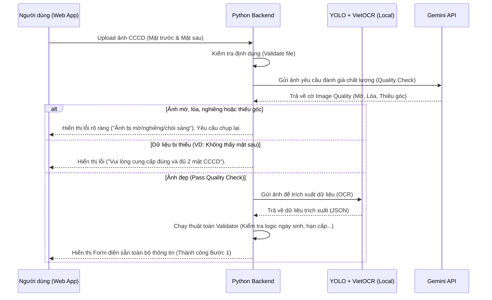
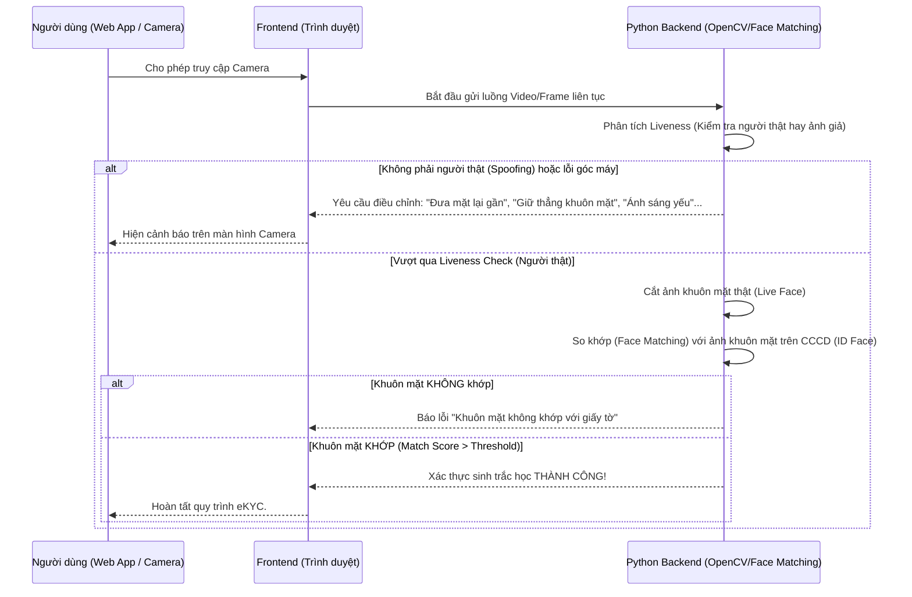

# Luồng hoạt động hệ thống eKYC (Workflow)

Tài liệu này mô tả chi tiết luồng xử lý của hệ thống eKYC, được chia làm 2 giai đoạn chính.

## Giai đoạn 1: Bóc tách & Đánh giá chất lượng CCCD (Document OCR & Quality Check)

Giai đoạn này đảm bảo dữ liệu đầu vào trên giấy tờ là chính xác, hình ảnh rõ nét, không bị che khuất trước khi đi tiếp.

## Giai đoạn 2: Xác thực khuôn mặt thời gian thực (Liveness & Face Matching)

Giai đoạn này đảm bảo người đang thao tác trên thiết bị chính là chủ nhân của giấy tờ CCCD. Ứng dụng Web sẽ yêu cầu cấp quyền truy cập Camera.

## Cơ chế chống tấn công (DDoS / Lạm dụng) - Dự kiến tương lai
- Ở Bước 1: Nếu một IP hoặc tài khoản liên tiếp gửi ảnh sai/chụp lỗi quá N lần -> Khóa tạm thời 15 phút.
- Ở Bước 2: Nếu xác thực khuôn mặt sai quá N lần -> Khóa tài khoản, yêu cầu liên hệ CSKH.
